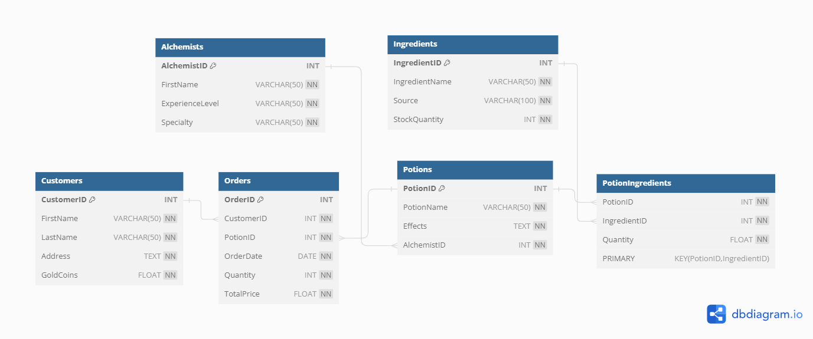

# Modern Magic Potion Shop

Welcome to the Modern Magic Potion Shop, where ancient magic meets modern technology! Our resident witch is in dire need of a database to manage all her orders.

## Introduction

**Witch**: "Welcome to the Modern Magic Potion Shop! A place where you can find potions and remedies for all of your desires. Business is booming, and I'm losing track of everything, so I need a database to help me. Will you help me?"

**SQL Sorcerer**: "Sure! In this repository, you will find everything you need to set up and manage the shop's database."

## Database Structure

The database includes the following tables:
- `Alchemists`: Stores information about alchemists.
- `Ingredients`: Stores information about potion ingredients.
- `Potions`: Stores information about potions.
- `PotionIngredients`: Join table for potions and ingredients.
- `Customers`: Stores information about customers.
- `Orders`: Stores information about orders placed by customers.

